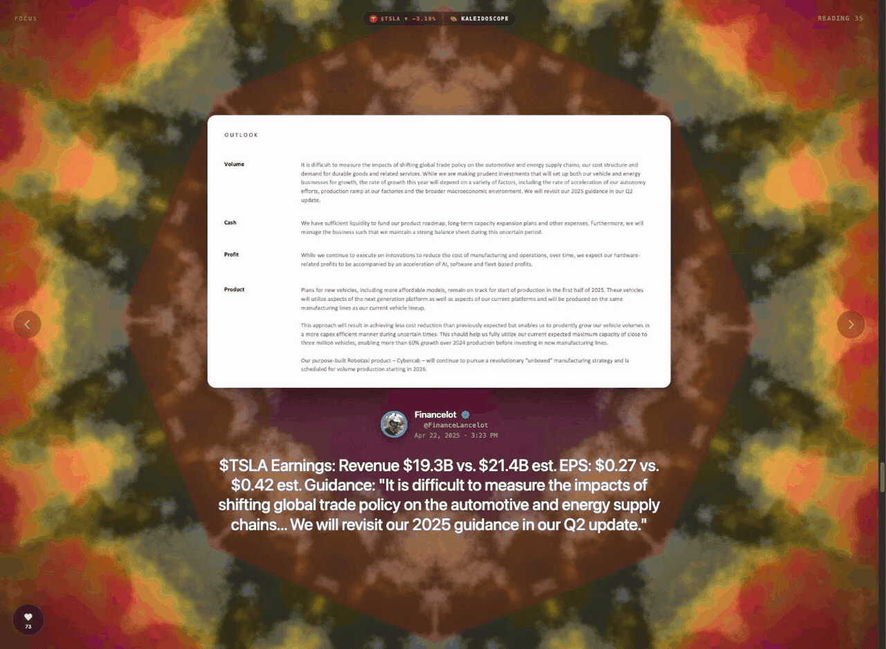

# Xpeaker

[](https://chromewebstore.google.com/detail/xpeaker/kmglffjlieflbckmhmmbdbgfpboncmij)

<p align="center"></p>

Read **X / Twitter** posts aloud with a 🔊 button on every post — speech is produced by Chrome's
built-in `chrome.tts` engine, routed to the **Supertonic Text-to-Speech Voices** companion extension
that runs neural TTS **in your browser**. No host server, no Python, no ONNX model to install.

Ported from the [`tweet-reader-supertonic`](../tweet-reader-supertonic) userscript; the local
`supertonic serve` dependency is gone.

## Install

**[➕ Add Xpeaker to Chrome](https://chromewebstore.google.com/detail/xpeaker/kmglffjlieflbckmhmmbdbgfpboncmij)** from the Chrome Web Store.

For high-quality neural voices, also install the free **[Supertonic Text-to-Speech Voices](https://chromewebstore.google.com/detail/supertonic-text-to-speech/mdoplmghlkjcnegkdhocjbjcncocbdhk)**
companion (the engine that actually speaks — the same mechanism Read Aloud uses). Without it,
Xpeaker falls back to your browser's built-in voices.

Then open `x.com` — each post gets a 🔊 button in its action bar, and a floating control dock sits
bottom-left. Click its Xpeaker mark to drop into **Focus Mode** — a full-screen, distraction-free
reader (see below).

**From source (dev):** `chrome://extensions` → enable **Developer mode** → **Load unpacked** →
select this `xpeaker/` folder.

## Use

- **Single mode** (default): click 🔊 on a post → it's read aloud; click again to stop.
- **Thread mode**: flip the bar's **Single / Thread** toggle (or `Alt+T`) → click a post → reads from there
  onward, auto-scrolling and de-duping by tweet id. Skip/prev/stop from the bar. Promoted/ad posts are skipped.
- **Full posts**: long "Show more"-truncated posts are expanded inline and read in full (single and thread).
- **Control dock** (bottom-left): the Xpeaker mark is the anchor — hover to unfold the Single/Thread toggle,
  direction, prev/next, stop, speed, and ⚙ Settings. (Pause lives in Focus Mode, not here — see below.)
- **Popup** (toolbar icon): quick mode / direction / speed / stop + status.
- **Options** (⚙ or right-click → Xpeaker: Settings): default voice, speed, per-author voices,
  auto-voice-per-author, announce author, alt-text, pause-on-video, browser-voice fallback, and Focus-Mode
  video sound (auto-play with audio up to N minutes; longer clips play as silent background).

### Focus Mode

A full-screen, distraction-free thread reader. Click the **Xpeaker mark** on the dock, pick a reading
direction (**↑ Newer / ↓ Older**), and it takes over the screen — one post at a time over an ambient
animated background, TTS-synced.

- **Rich content**: author + avatar + verified badge, the post text auto-fit to the screen (long posts
  scroll), photos (carousel with dots), **video** (mirrored to a canvas — plays with sound for clips within
  your limit, silent background otherwise), and quoted tweets rendered as their own nested card.
- **Act without leaving**: a heart in the corner unfolds to like / repost / bookmark / reply, a **Follow**
  button appears for authors you don't follow, and **↗** opens the current post in a *background* tab to
  revisit later without interrupting the read. "FOCUS" (top-left) doubles as an exit.
- **Navigate**: play/pause + prev/next/speed in the dock, big ‹ › arrows on the page edges, or `Alt+Space`
  to pause. A completion card appears when the thread ends.
- Toggle it from the dock's Xpeaker mark, the popup, the right-click menu, or a persisted setting.

### Mood ring (opt-in · on-device)

Turn it on in **Settings → Mood ring** and Focus Mode colours the ambient field to each post's emotion.
A small classifier (`emotion-english-distilroberta`, 7 emotions) reads the caption and eases the
background toward **joy** (gold), **sadness** (blue), **anger** (red), **fear** (violet), **disgust**
(green), **surprise** (pink), or **neutral** (slate) — with a matching mood pill and edge vignette.
It runs **entirely in your browser** (an offscreen WASM document — see Architecture); enabling it does a
one-time model download (~83 MB, then cached). No tweet text ever leaves your machine. ~80 ms per post.

**Background scenes:** pick the animated backdrop in **Settings → Focus Mode → Background scene**, or cycle
it live from the dock's layers button. Most are **data-driven GLSL shaders** (a fragment-shader string +
a name), so new ones are a cheap data drop rather than new code:
- **Aurora / Plasma / Nebula** — ambient shader fields (Nebula drifts with stars).
- **Tunnel / Kaleidoscope / Fractal** — a mouse-steered fly-through, an 8-fold mandala, and an animated Julia set.
- **Kleinian** — a raymarched IFS fractal.
- **Matrix rain** — katakana rain.
- **Doodle** — scribble in the empty margins; pen colour follows the mood, strokes persist, double-click clears.
- **Smash** — click/drag the margins to unleash a mood-assigned "weapon" (🔥 flamethrower, 🐜 ants, 🪚 chainsaw, 💧 rain, 🎆 fireworks, 💣 demolition, 💨 smoke) that sprays particles and burns persistent damage; a HUD names it.

The mood ring colours whichever shader is active (Aurora/Matrix work without it too). The Doodle and Smash
scenes only draw in the empty margins, never over the post, media, or controls.

**Signature & ticker shaders:** two ways a shader takes over automatically for a specific post, then reverts:
- **Creator signatures** — a shader keyed to an author fires when *their* post is read (in anyone's feed), with a ✨ credit chip.
- **Ticker shaders** — a `$cashtag` for a top asset (equities, `$BTC`/`$ETH`, gold/silver) lights the background in the asset's brand colour, tinted **bull** (green, rising) or **bear** (red, falling). The direction reads X's inline price-card % when present, otherwise the post's tone; a chip shows e.g. `$NVDA ▲ NVIDIA`. The asset table is a static snapshot of the top market caps — no API. Toggle both in Settings.

### Keyboard
Two styles (Settings → Keyboard shortcuts), all `Alt` + key:
- **Default:** `Alt+R` read · `Alt+T` thread · `Alt+S` stop · `Alt+N`/`Alt+B` next/back · `Alt+Space` pause (Focus) · `Alt+↑`/`Alt+↓` speed.
- **Vim-ish:** `Alt+P` read · `Alt+J`/`Alt+K` down/up · `Alt+T` thread · `Alt+Space` pause (Focus) · `Alt+S` stop · `Alt+H`/`Alt+L` slower/faster.

## Architecture

```
 x.com page (content.js)            extension service worker            companion ext
 ┌───────────────────────┐  Port   ┌────────────────────────┐  tts   ┌──────────────┐
 │ buttons, bar, thread   │ ──────▶ │ chrome.tts.speak(...)  │ ─────▶ │ Supertonic   │
 │ walk, text extraction  │ ◀────── │ relays tts events back │        │ voices (WASM)│
 └───────────────────────┘ events  └────────────────────────┘        └──────────────┘
```

`chrome.tts` isn't callable from content scripts, so the content script speaks via a long-lived
`chrome.runtime` Port to the service worker, which owns `chrome.tts` and relays `start`/`word`/`end`/
`error`/`interrupted` events. The `speak()` promise resolves `ended`/`error`/`stopped` — a drop-in for
the userscript's old `playArrayBuffer`.

Focus Mode's **Follow** button needs each author's follow relationship, which lives in X's React props —
a page-world expando invisible to the isolated content-script world. A tiny `content/mainworld.js` runs
in the page's own JS context (`"world": "MAIN"`), reads it off the fiber, and answers a synchronous DOM
event by stamping a `data-xp-following` attribute the content script can read.

The **mood ring** classifier can't run in a content script (x.com's CSP blocks the WASM runtime) or the
service worker (no DOM), so it lives in an **offscreen document** (`chrome.offscreen`): content script →
service worker → offscreen → back. The offscreen page loads Transformers.js + ONNX-Runtime WASM
(vendored locally under `vendor/transformers/`, single-threaded asyncify build) and fetches the model
weights from HuggingFace once. Requires an `extension_pages` CSP with `wasm-unsafe-eval`.

Focus **background shaders are data, not code**: a shader is a GLSL fragment string plus a name, compiled
onto one shared WebGL canvas that gets a fixed uniform set (time, resolution, per-tweet pulse, mood
colour, mouse — and for ticker shaders, brand colour + bull/bear trend). A per-post resolver picks the
scene (**author signature > `$cashtag` ticker > your chosen scene**) and hot-swaps the fragment in place,
so a new shader is a one-line data drop. GLSL is *compiled*, never `eval`'d, so it stays CSP-safe on x.com.

## Files
- `manifest.json` — MV3 contract (permissions: `tts`, `storage`, `contextMenus`, `offscreen`; HuggingFace `host_permissions` + a `wasm-unsafe-eval` `extension_pages` CSP for the mood classifier; content scripts on x/twitter).
- `background/service-worker.js` — chrome.tts owner, port bridge, context menus, offscreen-doc lifecycle + classify relay.
- `content/content.js` + `content.css` — all on-page UI/logic (buttons, dock, thread reader, Focus Mode, mood ring, GLSL background shaders + signatures + ticker shaders, extraction, keyboard, auto-duck).
- `content/mainworld.js` — MAIN-world bridge that reads follow-state off X's React fiber.
- `offscreen/` — hidden document that runs the on-device emotion classifier (Transformers.js / ONNX WASM).
- `vendor/transformers/` — vendored Transformers.js (ORT-inlined build) + the asyncify ONNX-Runtime WASM.
- `options/` — full settings page. `popup/` — quick controls. `icons/` — toolbar/store icons.

**Word highlighting** (Settings → Word highlighting): a karaoke **caption overlay** that tracks the
spoken word, plus best-effort in-post highlighting (CSS Custom Highlight API) when the spoken text
matches the tweet. Needs the voice engine to emit `word` events; degrades to a plain caption otherwise.

**Single global reader:** `chrome.tts` is global to the browser, so starting a read in any tab
automatically stops a read running in another — no overlapping/echoing audio.

## On-device AI

**Classification is in** — the opt-in **mood ring** (see Focus Mode) runs a small in-browser emotion
classifier via Transformers.js / ONNX WASM in an offscreen document. Classification is a single forward
pass, so it's tiny and fast (~80 ms/post) — a different universe from generation.

**Generation was removed** — an earlier build ran a small in-browser LLM (transformers.js) for cleanup /
translate / a thread-summary mode. It was cut: the only model small enough to load reliably (Qwen-0.5B)
produced gibberish, and anything larger (Qwen-1.5B, Gemma) either OOM-aborts or isn't supported by
transformers.js yet. The code lives in git history; the revisit is tracked in
[#2](https://github.com/dgnsrekt/xpeaker/issues/2) (in-browser Supertonic + Web Audio FX) and
[#1](https://github.com/dgnsrekt/xpeaker/issues/1) (raw-ORT QAT engine).

## Not included
Thread summary, AI text cleanup/translate, export-thread-to-WAV, and the hover-prefetch *audio* cache —
the last two need raw audio buffers that `chrome.tts` doesn't expose (would require bundling Supertonic
in-browser instead of using the companion engine).

## Note on voice detection
Xpeaker treats voices whose name/engine mentions "Supertonic" (or, failing that, any extension-provided
`ttsEngine` voice) as the Supertonic set. After loading, open the service-worker console
(`chrome://extensions` → Xpeaker → *service worker* → inspect) and run
`chrome.tts.getVoices(v => console.log(v))` to confirm the real `voiceName`/`extensionId` strings. If the
companion advertises differently, tighten the filter in `content/content.js` (`pickEngineVoices`),
`options/options.js`, and `popup/popup.js`.

## Privacy

Xpeaker collects nothing and sends no user data anywhere — everything runs on your device, settings are
stored locally. The one network request is optional: enabling the **mood ring** downloads its model once
from HuggingFace (then cached); no tweet text or personal data is ever transmitted. See
[PRIVACY.md](PRIVACY.md). Without the Supertonic companion it falls back to your browser's built-in
voices, so it works on its own.

> Not affiliated with X Corp or Twitter, Inc. "X" / "Twitter" are referenced only to describe the
> site Xpeaker works on.
